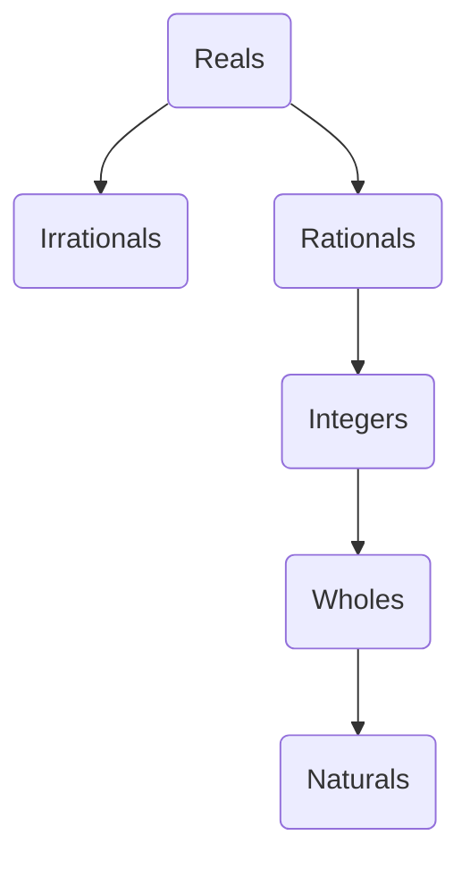

A collection of things or objects with defined characteristics is called a **set**. 

Sets are usually denoted by capital letters, and are represented by braces containing their elements separated by commas. For example, the set of vowel letters is as follows:

$$ V = \{\ a\ ,\ e\ ,\ i\ ,\ o\ ,\ u\ \} $$

In the case of sets of more elements, we can represent only some of them and use ellipsis notation to denote that there are more elements with the same characteristics. For example, the set of consonants could be expressed as follows:

$$ C = \{\ b\ ,\ c\ ,\ d\ ,\ f\ ,\ ...\ \} $$

We can say that $a$ belongs to the set $V$ with epsilon notation $\in$. Conversely, `b` can be said not to belong to it with strikethrough epsilon notation.

$$ a \ \in \ V $$
$$ b \ \notin \ V $$

There are two ways of expressing a set:

- **Descriptive form**: lists the properties of the set.
- **Enumerative form**: lists the elements of the set.

For example, to express the natural numbers divisors of 6: 

$$ S = \{\ x \ \in \ N\ :\ x\ divisor\ of\ 6 \} $$

```
The double-dot notation ":" means "such that".
```


# Sets properties

**Cardinality** is the number of elements in a set. 

- Empty sets (no elements) have cardinality 0.
- Finite sets have definite cardinality.
- Infinite sets have indefinite cardinality.

___
Non-empty sets of the same **cardinality** are called **equivalent sets**. 
___
Non-empty sets that have the same elements are called **equal sets**.
___
Sets that have no elements in common are called **disjoint sets**.
___

The representation of sets and subsets by plane figures is called a **Venn diagram**. The **set universe** is usually represented as a rectangle and its subsets as circles.

# Subsets

A set consisting exclusively of elements belonging to another set is called a **subset**. That is to say:

$$ A \subseteq B $$

___

A set that is a subset of another set and they are not the same is called a **proper subset**. For example, $A = \{ 1, 2 \}$ is a proper subset of $B = \{ 1, 2, 3, 4, 5 \}$. 

$$ A \subset B $$

___

A set of cardinality $n$ (where $n$ is a natural number) has $2^n$ subsets.

Let $A$ be a set, the set of all subsets of a set is called a **power set** or **set of parts of A**. It is denoted by $\mathbb{P}(A)$.

___

Given a group of sets, any set of which all such sets are subsets is called a **universe set**. For example, $A=1,2,3\}$ is a universe set of $B=1\}$, $C=2\}$ and $D=3\}$.


# Set operations

You can operate on sets using the following operands:

$A \cup B$ | **Union**: all elements of A and B.

$A \cap B$ | **Intersection": the elements common to A and B.

$A - B$ | **Difference**: the elements of A minus those in common with B.

$A \triangle B$ | **Symmetrical difference**: A and B minus the elements in common.

$x \notin A$ | **Complementary**: the set universe minus the elements of A.

Operations between sets are **commutative**, **associative** and **distributive**. In addition, **Morgan's laws** are satisfied. Being $C$ the conjugate of a set:

$$ (A \cup B)^c = A^c \cap B^c $$
$$ (A \cap B)^c = A^c \cup B^c $$


# Number sets

Generally, in mathematics, a group of numbers with similar characteristics is called a **set**. The most famous sets are the following:

Conjuntos | Definición
-|-
$\mathbb{N}$ | **natural**: they are mainly used for counting (1, 2, 3...).
$\mathbb{W}$| **whole**: the naturals and zero.
$\mathbb{Z}$| **integers**: positive and negative naturals and zero.
$\mathbb{Q}$| **rational**: can be expressed as a fraction. Includes **periodic**.
$\mathbb{R}$-$\mathbb{Q}$| **irrationals**: cannot be expressed as a fraction. Includes roots and Pi.  
$\mathbb{R}$| **real**: all **rational** and **irrational** numbers.
$\mathbb{C}$| **complexes**: those with a complex part ($\sqrt{-1}$).

```
Note that irrational numbers do not have their own symbol, but they can be represented as the real numbers minus the rational ones, i.e. R-Q.
```



